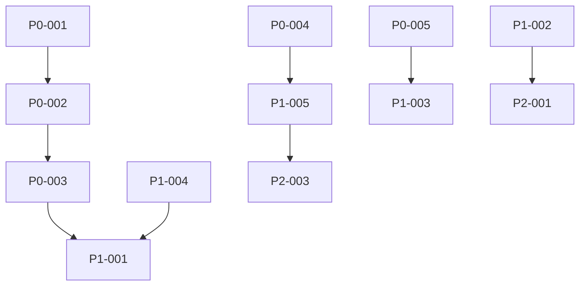

# 🔴 REAL ACTIONABLE TODO LIST - Income Clarity Fixes
*Based on actual broken functionality, not wishful documentation*
*Created: 2025-01-12 | Priority: CRITICAL - App is 0% functional*

---

## 🚨 P0 - CRITICAL BLOCKERS (Fix TODAY - 2 hours total)
*App won't work AT ALL without these*

### ✅ P0-001: Fix Database Path (5 minutes)
**File**: `/public/MasterV2/income-clarity/income-clarity-app/.env.local`
**Line**: 39
**Current (BROKEN)**:
```
DATABASE_URL=file:./prisma/income_clarity.db
```
**Fix to**:
```
DATABASE_URL=file:./data/income-clarity.db
```
**Test**: Run `npm run dev` - should not error on database connection

---

### ✅ P0-002: Enable LOCAL_MODE for Mock Data (5 minutes)
**File**: `/public/MasterV2/income-clarity/income-clarity-app/.env.local`
**Lines**: 9-10
**Current (BROKEN)**:
```
LOCAL_MODE=false
NEXT_PUBLIC_LOCAL_MODE=false
```
**Fix to**:
```
LOCAL_MODE=true
NEXT_PUBLIC_LOCAL_MODE=true
```
**Test**: Restart server, Super Cards should show mock data

---

### ✅ P0-003: Fix Prisma Client Syntax Errors (15 minutes)
**File**: `/public/MasterV2/income-clarity/income-clarity-app/lib/db/prisma-client.ts`
**Lines**: 125-289
**Problem**: Undefined variables `testUser`, `testPortfolio`, `testHolding`
**Fix**: Comment out entire test section:
```typescript
// Line 125: Add /* to start comment block
/*
    if (userWithPortfolios) {
      ...
// Line 289: Add */ to end comment block  
*/
    return true;  // Add this line
  } catch (error) {
    return false;
  }
}
```
**Test**: File should have no TypeScript errors

---

### ✅ P0-004: Fix Onboarding Redirect (30 minutes)
**File**: `/public/MasterV2/income-clarity/income-clarity-app/app/auth/signup/page.tsx`
**Problem**: After signup, user isn't redirected to onboarding
**Add after line where user is created**:
```typescript
// After successful signup (around line 150-200)
if (newUser && !newUser.onboardingCompleted) {
  router.push('/onboarding');
  return;
}
```
**Test**: Sign up new user → Should redirect to `/onboarding`

---

### ✅ P0-005: Add Portfolio Management Route (20 minutes)
**Create File**: `/public/MasterV2/income-clarity/income-clarity-app/app/dashboard/portfolio/page.tsx`
```typescript
'use client'
import { AddHoldingForm } from '@/components/forms/portfolio/AddHoldingForm'
import { BulkImportForm } from '@/components/forms/portfolio/BulkImportForm'
import { AppShell } from '@/components/AppShell'

export default function PortfolioPage() {
  return (
    <AppShell title="Portfolio Management">
      <div className="container mx-auto p-4">
        <h1 className="text-2xl font-bold mb-4">Manage Portfolio</h1>
        <div className="grid grid-cols-1 md:grid-cols-2 gap-6">
          <AddHoldingForm />
          <BulkImportForm />
        </div>
      </div>
    </AppShell>
  )
}
```
**Test**: Navigate to `/dashboard/portfolio` → Forms should appear

---

## 🟡 P1 - HIGH PRIORITY (Fix Day 1 - 4 hours)
*Core functionality broken*

### ⬜ P1-001: Fix Super Cards Data Loading (1 hour)
**File**: `/public/MasterV2/income-clarity/income-clarity-app/lib/api/super-cards-api.ts`
**Line**: 49
**Current Issue**: Checks LOCAL_MODE but it's an object, not boolean
**Fix**:
```typescript
// Line 49 - Change from:
if (LOCAL_MODE_CONFIG.enabled) {
// To:
if (LOCAL_MODE_CONFIG.ENABLED || process.env.NEXT_PUBLIC_LOCAL_MODE === 'true') {
```
**Test**: Super Cards should load mock data

---

### ⬜ P1-002: Fix Settings Page Context (45 minutes)
**File**: `/public/MasterV2/income-clarity/income-clarity-app/app/layout.tsx`
**Problem**: Missing context providers
**Add providers**:
```typescript
import { AuthProvider } from '@/contexts/AuthContext'
import { DataPersistenceProvider } from '@/contexts/DataPersistenceContext'

export default function RootLayout({ children }) {
  return (
    <html>
      <body>
        <AuthProvider>
          <DataPersistenceProvider>
            {children}
          </DataPersistenceProvider>
        </AuthProvider>
      </body>
    </html>
  )
}
```
**Test**: `/settings` page should not crash

---

### ⬜ P1-003: Add Navigation to Portfolio (30 minutes)
**File**: `/public/MasterV2/income-clarity/income-clarity-app/components/navigation/BottomNavigation.tsx`
**Add portfolio link**:
```typescript
{
  name: 'Portfolio',
  href: '/dashboard/portfolio',
  icon: Briefcase,
  badge: holdings?.length || 0
}
```
**Test**: Bottom nav should show Portfolio option

---

### ⬜ P1-004: Create Database Seed Script (1 hour)
**Create File**: `/public/MasterV2/income-clarity/income-clarity-app/scripts/seed-database.js`
```javascript
const { PrismaClient } = require('../lib/generated/prisma');
const prisma = new PrismaClient();

async function seed() {
  // Create test user
  const user = await prisma.user.create({
    data: {
      email: 'demo@incomeClarity.com',
      passwordHash: 'demo_password_hash',
      name: 'Demo User',
      onboardingCompleted: true
    }
  });

  // Create portfolio
  const portfolio = await prisma.portfolio.create({
    data: {
      userId: user.id,
      name: 'Main Portfolio',
      type: 'Taxable',
      isPrimary: true
    }
  });

  // Add holdings
  await prisma.holding.createMany({
    data: [
      { portfolioId: portfolio.id, ticker: 'JEPI', shares: 1000, costBasis: 54000 },
      { portfolioId: portfolio.id, ticker: 'JEPQ', shares: 500, costBasis: 25000 },
      { portfolioId: portfolio.id, ticker: 'SCHD', shares: 300, costBasis: 22000 }
    ]
  });

  console.log('Database seeded!');
}

seed().catch(console.error).finally(() => prisma.$disconnect());
```
**Run**: `node scripts/seed-database.js`
**Test**: Database should have sample data

---

### ⬜ P1-005: Fix Authentication Flow (45 minutes)
**File**: `/public/MasterV2/income-clarity/income-clarity-app/app/api/auth/signup/route.ts`
**Add session creation**:
```typescript
import { cookies } from 'next/headers'
import jwt from 'jsonwebtoken'

// After user creation
const token = jwt.sign(
  { userId: newUser.id, email: newUser.email },
  process.env.SESSION_SECRET || 'dev_secret',
  { expiresIn: '7d' }
)

cookies().set('session', token, {
  httpOnly: true,
  secure: process.env.NODE_ENV === 'production',
  sameSite: 'lax',
  maxAge: 60 * 60 * 24 * 7 // 7 days
})
```
**Test**: After signup, user should be logged in

---

## 🟠 P2 - MEDIUM PRIORITY (Fix Day 2 - 6 hours)
*Important but not blocking*

### ⬜ P2-001: Create Income Tracking Page (2 hours)
**Create**: `/app/dashboard/income/page.tsx`
- Import and use existing income forms
- Connect to database
- Display income list

### ⬜ P2-002: Create Expense Management Page (2 hours)
**Create**: `/app/dashboard/expenses/page.tsx`
- Import expense forms
- CRUD operations
- Monthly summary

### ⬜ P2-003: Fix User Model Schema (30 minutes)
**File**: `/lib/generated/prisma/schema.prisma`
**Add to User model**:
```prisma
onboardingCompleted Boolean @default(false)
monthlyExpenses Float?
monthlyContribution Float?
age Int?
```
**Run**: `npx prisma db push`

### ⬜ P2-004: Connect Super Cards to Real Data (1.5 hours)
**File**: `/lib/services/super-cards-database.service.ts`
- Implement actual database queries
- Replace mock data returns
- Test each Super Card

---

## 🟢 P3 - LOW PRIORITY (Fix Week 2)
*Nice to have*

### ⬜ P3-001: Add Error Boundaries
### ⬜ P3-002: Implement Loading States
### ⬜ P3-003: Add Data Validation
### ⬜ P3-004: Performance Optimization
### ⬜ P3-005: Mobile Responsive Fixes
### ⬜ P3-006: PWA Features
### ⬜ P3-007: Export/Import Data
### ⬜ P3-008: Dark Mode Persistence

---

## 📊 TASK DEPENDENCIES



---

## ✅ SUCCESS CRITERIA

### After P0 Tasks (2 hours):
- [ ] App starts without errors
- [ ] Can navigate to `/dashboard/portfolio`
- [ ] Super Cards show mock data
- [ ] New users redirected to onboarding
- [ ] No TypeScript/build errors

### After P1 Tasks (6 hours total):
- [ ] Can add portfolio holdings
- [ ] Settings page works
- [ ] Super Cards load data
- [ ] User can sign up and log in
- [ ] Database has seed data

### After P2 Tasks (12 hours total):
- [ ] Full CRUD for portfolio/income/expenses
- [ ] All 5 Super Cards functional
- [ ] Complete user journey works
- [ ] Data persists correctly

---

## 🚀 QUICK START FOR DEVELOPERS

```bash
# 1. Clone and setup
cd /public/MasterV2/income-clarity/income-clarity-app

# 2. Apply P0 fixes (edit files as specified above)
vim .env.local  # Fix DATABASE_URL and LOCAL_MODE
vim lib/db/prisma-client.ts  # Comment lines 125-289

# 3. Install and generate
npm install
npx prisma generate
npx prisma db push

# 4. Start development
npm run dev

# 5. Test critical path
# - Sign up new user
# - Should redirect to onboarding
# - Complete onboarding
# - Navigate to dashboard
# - Super Cards should show data
# - Navigate to /dashboard/portfolio
# - Add a holding
```

---

## ⏱️ TIME ESTIMATES

| Priority | Tasks | Time | Cumulative |
|----------|-------|------|------------|
| P0 | 5 tasks | 2 hours | 2 hours |
| P1 | 5 tasks | 4 hours | 6 hours |
| P2 | 4 tasks | 6 hours | 12 hours |
| P3 | 8 tasks | 28 hours | 40 hours |

**Total to Functional**: 12 hours (P0+P1+P2)
**Total to Polished**: 40 hours (All)

---

## 📝 NOTES FOR CODERS

1. **Start with P0 tasks** - Nothing works without these
2. **Test after each fix** - Don't accumulate bugs
3. **LOCAL_MODE is your friend** - Use it for development
4. **Check console errors** - Browser and terminal
5. **Database path is critical** - Must point to actual file
6. **Don't trust the docs** - Test everything yourself

---

## 🎯 DEFINITION OF DONE

A task is ONLY complete when:
1. ✅ Code changes made as specified
2. ✅ No TypeScript errors
3. ✅ No console errors
4. ✅ Feature actually works when tested
5. ✅ User can access and use the feature

**Current Status**: 0/30 tasks complete (0% done)

---

*This is the REAL todo list based on actual testing, not documentation fantasies.*