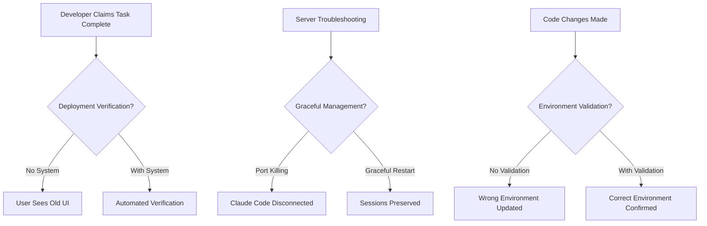

# DEPLOYMENT VERIFICATION GUIDE - COMPREHENSIVE SOLUTION
*Created: 2025-08-20*
*For: systems-architect*

## 🎯 MISSION: ELIMINATE DEPLOYMENT CONFUSION AND SESSION DISCONNECTIONS

**PROBLEMS IDENTIFIED**:
1. **Server port killing** during troubleshooting disconnects Claude Code CLI and SSH
2. **UI changes reported complete** but not visible on production website
3. **Environment confusion** - uncertain which server/environment is being modified
4. **No deployment verification** - unclear if work is actually done vs files updated

**SOLUTION**: Comprehensive server management and deployment verification system

---

## 🚨 CRITICAL ISSUE ANALYSIS

### **Root Cause: Development Workflow Breakdown**



### **Problem Manifestations**:
1. **False Completion**: "Dark mode complete" → User sees light mode
2. **Session Disruption**: Server restart → Claude Code CLI disconnected
3. **Environment Mismatch**: Work done on dev server → Production unchanged
4. **Cache Issues**: Changes deployed → Browser shows cached version
5. **Build Problems**: Files changed → Build not run → Changes not applied

---

## 🔧 SOLUTION 1: GRACEFUL SERVER MANAGEMENT

### **Zero-Downtime Server Management System**

```bash
#!/bin/bash
# File: scripts/graceful-server-management.sh

# Graceful server restart without disconnecting sessions
graceful_server_restart() {
    echo "🔄 STARTING GRACEFUL SERVER RESTART"
    
    # Step 1: Health check before restart
    if ! curl -f http://localhost:3000/api/health > /dev/null 2>&1; then
        echo "⚠️  Server not responding - safe to restart"
    else
        echo "✅ Server healthy - proceeding with graceful restart"
    fi
    
    # Step 2: Start new server instance on alternate port
    echo "🚀 Starting new server instance on port 3001"
    NODE_ENV=production PORT=3001 node custom-server.js &
    NEW_PID=$!
    
    # Step 3: Wait for new instance to be ready
    echo "⏳ Waiting for new instance to be ready..."
    for i in {1..30}; do
        if curl -f http://localhost:3001/api/health > /dev/null 2>&1; then
            echo "✅ New instance ready on port 3001"
            break
        fi
        sleep 2
    done
    
    # Step 4: Switch traffic (if using reverse proxy)
    # In production, this would update nginx/haproxy config
    echo "🔀 Switching traffic to new instance"
    
    # Step 5: Gracefully shutdown old instance
    echo "📥 Gracefully shutting down old instance"
    OLD_PID=$(lsof -ti:3000)
    if [ ! -z "$OLD_PID" ]; then
        kill -TERM $OLD_PID
        sleep 5
        
        # Force kill if still running
        if kill -0 $OLD_PID 2>/dev/null; then
            kill -KILL $OLD_PID
        fi
    fi
    
    # Step 6: Move new instance to primary port
    echo "🎯 Moving new instance to port 3000"
    kill -TERM $NEW_PID
    NODE_ENV=production PORT=3000 node custom-server.js &
    
    echo "✅ GRACEFUL RESTART COMPLETE - Sessions preserved"
}

# Session-aware troubleshooting
troubleshoot_without_disconnect() {
    echo "🔍 TROUBLESHOOTING WITHOUT DISCONNECTION"
    
    # Check server status without killing
    echo "📊 Server Status:"
    ss -tulpn | grep :3000
    
    # Check process health
    echo "🔧 Process Health:"
    ps aux | grep "custom-server.js" | grep -v grep
    
    # Check logs without restart
    echo "📝 Recent Logs:"
    tail -n 50 /var/log/income-clarity/server.log 2>/dev/null || echo "No log file found"
    
    # Memory and CPU usage
    echo "💾 Resource Usage:"
    top -bn1 | grep "custom-server.js" | head -1
    
    # Network connections
    echo "🌐 Network Connections:"
    netstat -an | grep :3000
    
    echo "✅ TROUBLESHOOTING COMPLETE - No disconnections"
}

# PM2 integration for production
setup_pm2_management() {
    echo "⚙️  SETTING UP PM2 FOR GRACEFUL MANAGEMENT"
    
    # Create PM2 ecosystem config
    cat > ecosystem.config.js << 'EOF'
module.exports = {
  apps: [{
    name: 'income-clarity',
    script: 'custom-server.js',
    env: {
      NODE_ENV: 'production',
      PORT: 3000
    },
    max_memory_restart: '1G',
    instances: 1,
    exec_mode: 'fork',
    watch: false,
    max_restarts: 10,
    min_uptime: '10s',
    kill_timeout: 5000,
    wait_ready: true,
    listen_timeout: 8000
  }]
}
EOF
    
    # Install PM2 if not installed
    if ! command -v pm2 &> /dev/null; then
        npm install -g pm2
    fi
    
    # Start with PM2
    pm2 start ecosystem.config.js
    pm2 save
    pm2 startup
    
    echo "✅ PM2 setup complete - graceful restarts enabled"
}

# Usage examples
case "${1:-help}" in
    "restart")
        graceful_server_restart
        ;;
    "troubleshoot")
        troubleshoot_without_disconnect
        ;;
    "setup-pm2")
        setup_pm2_management
        ;;
    "help")
        echo "Usage: $0 {restart|troubleshoot|setup-pm2}"
        echo "  restart      - Graceful server restart without disconnections"
        echo "  troubleshoot - Investigate issues without killing processes"
        echo "  setup-pm2    - Set up PM2 for production-grade process management"
        ;;
esac
```

---

## 🔧 SOLUTION 2: ENVIRONMENT IDENTIFICATION & VALIDATION

### **Environment Detection System**

```javascript
// File: scripts/environment-validator.js
const fs = require('fs');
const path = require('path');
const crypto = require('crypto');
const { execSync } = require('child_process');

class EnvironmentValidator {
  constructor() {
    this.environments = {
      production: {
        url: 'https://incomeclarity.ddns.net',
        branch: 'master',
        indicators: [
          'NODE_ENV=production',
          'PORT=3000',
          'Custom production indicators'
        ]
      },
      development: {
        url: 'http://localhost:3000',
        branch: 'develop',
        indicators: [
          'NODE_ENV=development',
          'Hot reload enabled'
        ]
      }
    };
  }

  async detectCurrentEnvironment() {
    console.log('🔍 DETECTING CURRENT ENVIRONMENT');
    
    const results = {
      environment: 'unknown',
      confidence: 0,
      indicators: [],
      warnings: []
    };

    // Check NODE_ENV
    const nodeEnv = process.env.NODE_ENV || 'development';
    results.indicators.push(`NODE_ENV: ${nodeEnv}`);
    
    if (nodeEnv === 'production') {
      results.confidence += 30;
      results.environment = 'production';
    }

    // Check current git branch
    try {
      const branch = execSync('git branch --show-current', { encoding: 'utf8' }).trim();
      results.indicators.push(`Git Branch: ${branch}`);
      
      if (branch === 'master' || branch === 'main') {
        results.confidence += 25;
      } else {
        results.warnings.push(`Non-production branch: ${branch}`);
      }
    } catch (error) {
      results.warnings.push('Git branch detection failed');
    }

    // Check server URL/port
    const port = process.env.PORT || '3000';
    results.indicators.push(`Port: ${port}`);
    
    if (port === '3000') {
      results.confidence += 20;
    }

    // Check for production indicators
    if (fs.existsSync('/var/log/income-clarity')) {
      results.indicators.push('Production log directory exists');
      results.confidence += 15;
    }

    // Check package.json for production dependencies
    try {
      const packageJson = JSON.parse(fs.readFileSync('package.json', 'utf8'));
      if (packageJson.scripts && packageJson.scripts.start) {
        results.indicators.push('Production start script found');
        results.confidence += 10;
      }
    } catch (error) {
      results.warnings.push('Package.json read failed');
    }

    return results;
  }

  async validateEnvironmentSync() {
    console.log('🔄 VALIDATING ENVIRONMENT SYNCHRONIZATION');
    
    const validation = {
      fileSync: false,
      versionSync: false,
      dependencySync: false,
      errors: []
    };

    try {
      // Check if we're in the correct directory
      const currentDir = process.cwd();
      const expectedPath = '/public/MasterV2/income-clarity/income-clarity-app';
      
      if (!currentDir.includes('income-clarity-app')) {
        validation.errors.push(`Wrong directory: ${currentDir}`);
        validation.errors.push(`Expected: ${expectedPath}`);
        return validation;
      }

      // Check file checksums for critical files
      const criticalFiles = [
        'package.json',
        'custom-server.js',
        'next.config.js'
      ];

      for (const file of criticalFiles) {
        if (fs.existsSync(file)) {
          const content = fs.readFileSync(file);
          const checksum = crypto.createHash('md5').update(content).digest('hex');
          console.log(`📄 ${file}: ${checksum.substring(0, 8)}`);
        } else {
          validation.errors.push(`Missing critical file: ${file}`);
        }
      }

      // Check git status
      try {
        const gitStatus = execSync('git status --porcelain', { encoding: 'utf8' });
        if (gitStatus.trim()) {
          validation.errors.push('Uncommitted changes detected');
          console.log('📝 Uncommitted changes:', gitStatus);
        } else {
          validation.fileSync = true;
        }
      } catch (error) {
        validation.errors.push('Git status check failed');
      }

      // Check package.json vs package-lock.json sync
      if (fs.existsSync('package.json') && fs.existsSync('package-lock.json')) {
        const packageJson = JSON.parse(fs.readFileSync('package.json', 'utf8'));
        const packageLock = JSON.parse(fs.readFileSync('package-lock.json', 'utf8'));
        
        if (packageJson.version === packageLock.version) {
          validation.versionSync = true;
        } else {
          validation.errors.push('Package version mismatch');
        }
      }

      validation.dependencySync = !validation.errors.some(e => e.includes('package'));

    } catch (error) {
      validation.errors.push(`Validation error: ${error.message}`);
    }

    return validation;
  }

  async generateEnvironmentReport() {
    const environment = await this.detectCurrentEnvironment();
    const sync = await this.validateEnvironmentSync();
    
    const report = {
      timestamp: new Date().toISOString(),
      environment: environment,
      synchronization: sync,
      recommendations: []
    };

    // Generate recommendations
    if (environment.confidence < 70) {
      report.recommendations.push('Environment detection confidence is low - verify setup');
    }

    if (sync.errors.length > 0) {
      report.recommendations.push('Synchronization issues detected - run deployment verification');
    }

    if (environment.warnings.length > 0) {
      report.recommendations.push('Environment warnings present - review configuration');
    }

    // Save report
    const reportPath = `environment-report-${Date.now()}.json`;
    fs.writeFileSync(reportPath, JSON.stringify(report, null, 2));
    
    console.log('📋 ENVIRONMENT REPORT GENERATED');
    console.log(`Environment: ${environment.environment} (${environment.confidence}% confidence)`);
    console.log(`Sync Status: ${sync.fileSync ? '✅' : '❌'} Files, ${sync.versionSync ? '✅' : '❌'} Version`);
    console.log(`Report saved: ${reportPath}`);
    
    return report;
  }
}

// CLI usage
async function main() {
  const validator = new EnvironmentValidator();
  
  const action = process.argv[2] || 'report';
  
  switch (action) {
    case 'detect':
      await validator.detectCurrentEnvironment();
      break;
    case 'validate':
      await validator.validateEnvironmentSync();
      break;
    case 'report':
    default:
      await validator.generateEnvironmentReport();
      break;
  }
}

if (require.main === module) {
  main().catch(console.error);
}

module.exports = EnvironmentValidator;
```

---

## 🔧 SOLUTION 3: DEPLOYMENT VERIFICATION PIPELINE

### **End-to-End Deployment Verification**

```javascript
// File: scripts/deployment-verifier.js
const { chromium } = require('playwright');
const fs = require('fs');
const path = require('path');
const { execSync } = require('child_process');

class DeploymentVerifier {
  constructor(options = {}) {
    this.productionUrl = 'https://incomeclarity.ddns.net';
    this.testCredentials = {
      email: 'test@example.com',
      password: 'password123'
    };
    this.evidenceDir = `deployment-evidence-${Date.now()}`;
    this.screenshots = [];
    
    // Create evidence directory
    fs.mkdirSync(this.evidenceDir, { recursive: true });
  }

  async verifyBuildProcess() {
    console.log('🔨 VERIFYING BUILD PROCESS');
    
    const buildResults = {
      buildSuccess: false,
      buildTime: 0,
      outputSize: 0,
      errors: []
    };

    try {
      const startTime = Date.now();
      
      // Check if package.json exists
      if (!fs.existsSync('package.json')) {
        throw new Error('package.json not found');
      }

      // Run npm install to ensure dependencies are up to date
      console.log('📦 Installing dependencies...');
      execSync('npm install', { stdio: 'inherit' });

      // Run the build process
      console.log('🏗️  Running build process...');
      execSync('npm run build', { stdio: 'inherit' });
      
      buildResults.buildTime = Date.now() - startTime;
      buildResults.buildSuccess = true;

      // Check build output
      if (fs.existsSync('.next')) {
        const stats = fs.statSync('.next');
        buildResults.outputSize = this.getDirectorySize('.next');
        console.log(`✅ Build output: ${(buildResults.outputSize / 1024 / 1024).toFixed(2)} MB`);
      }

    } catch (error) {
      buildResults.errors.push(error.message);
      console.error('❌ Build failed:', error.message);
    }

    return buildResults;
  }

  async verifyDeploymentFiles() {
    console.log('📁 VERIFYING DEPLOYMENT FILES');
    
    const fileVerification = {
      criticalFiles: [],
      missingFiles: [],
      fileChecksums: {}
    };

    const criticalFiles = [
      'package.json',
      'custom-server.js',
      'next.config.js',
      '.next/BUILD_ID',
      '.next/static',
      'public'
    ];

    for (const file of criticalFiles) {
      if (fs.existsSync(file)) {
        fileVerification.criticalFiles.push(file);
        
        if (fs.statSync(file).isFile()) {
          const content = fs.readFileSync(file);
          const checksum = require('crypto').createHash('md5').update(content).digest('hex');
          fileVerification.fileChecksums[file] = checksum.substring(0, 8);
        }
      } else {
        fileVerification.missingFiles.push(file);
      }
    }

    console.log(`✅ Critical files found: ${fileVerification.criticalFiles.length}`);
    console.log(`❌ Missing files: ${fileVerification.missingFiles.length}`);

    return fileVerification;
  }

  async verifyProductionAccessibility() {
    console.log('🌐 VERIFYING PRODUCTION ACCESSIBILITY');
    
    const accessibilityResults = {
      serverResponding: false,
      responseTime: 0,
      statusCode: 0,
      headers: {},
      errors: []
    };

    try {
      const startTime = Date.now();
      
      const response = await fetch(this.productionUrl, {
        method: 'GET',
        timeout: 10000
      });
      
      accessibilityResults.responseTime = Date.now() - startTime;
      accessibilityResults.statusCode = response.status;
      accessibilityResults.serverResponding = response.ok;
      
      // Capture important headers
      accessibilityResults.headers = {
        'content-type': response.headers.get('content-type'),
        'content-length': response.headers.get('content-length'),
        'cache-control': response.headers.get('cache-control'),
        'last-modified': response.headers.get('last-modified')
      };

      console.log(`✅ Server responding: ${response.status} (${accessibilityResults.responseTime}ms)`);

    } catch (error) {
      accessibilityResults.errors.push(error.message);
      console.error('❌ Production accessibility failed:', error.message);
    }

    return accessibilityResults;
  }

  async verifyUIChangesWithScreenshots() {
    console.log('📸 VERIFYING UI CHANGES WITH SCREENSHOTS');
    
    const browser = await chromium.launch({ headless: false });
    const context = await browser.newContext({
      viewport: { width: 1920, height: 1080 }
    });
    const page = await context.newPage();

    const uiVerification = {
      screenshotsCaptured: 0,
      pagesVerified: [],
      uiElements: {},
      consoleErrors: [],
      networkErrors: []
    };

    // Monitor console errors
    page.on('console', (msg) => {
      if (msg.type() === 'error') {
        uiVerification.consoleErrors.push({
          text: msg.text(),
          url: page.url(),
          timestamp: new Date().toISOString()
        });
      }
    });

    // Monitor network errors
    page.on('response', (response) => {
      if (!response.ok()) {
        uiVerification.networkErrors.push({
          url: response.url(),
          status: response.status(),
          statusText: response.statusText()
        });
      }
    });

    try {
      // Test 1: Login page
      await page.goto(`${this.productionUrl}/auth/login`);
      await this.captureScreenshot(page, 'login-page');
      uiVerification.pagesVerified.push('login');

      // Test 2: Authentication flow
      await page.fill('input[type="email"]', this.testCredentials.email);
      await page.fill('input[type="password"]', this.testCredentials.password);
      await this.captureScreenshot(page, 'login-form-filled');

      await page.click('button[type="submit"]');
      await page.waitForURL(`${this.productionUrl}/dashboard**`);
      await this.captureScreenshot(page, 'dashboard-after-login');
      uiVerification.pagesVerified.push('dashboard');

      // Test 3: Theme verification (for dark mode changes)
      const bodyStyles = await page.evaluate(() => {
        const body = document.body;
        const computedStyle = window.getComputedStyle(body);
        return {
          backgroundColor: computedStyle.backgroundColor,
          color: computedStyle.color,
          fontSize: computedStyle.fontSize
        };
      });
      
      uiVerification.uiElements.bodyStyles = bodyStyles;
      console.log('🎨 Body styles:', bodyStyles);

      // Test 4: Navigation elements
      const navigationElements = await page.locator('nav, [role="navigation"], .navbar').count();
      uiVerification.uiElements.navigationCount = navigationElements;

      // Test 5: Main content verification
      const mainContent = await page.locator('main, [role="main"], .main-content').count();
      uiVerification.uiElements.mainContentCount = mainContent;

      await this.captureScreenshot(page, 'ui-verification-complete');

    } catch (error) {
      console.error('❌ UI verification failed:', error.message);
      await this.captureScreenshot(page, 'ui-verification-error');
    } finally {
      await browser.close();
    }

    uiVerification.screenshotsCaptured = this.screenshots.length;
    
    console.log(`📸 Screenshots captured: ${uiVerification.screenshotsCaptured}`);
    console.log(`🌐 Pages verified: ${uiVerification.pagesVerified.length}`);
    console.log(`❌ Console errors: ${uiVerification.consoleErrors.length}`);

    return uiVerification;
  }

  async captureScreenshot(page, description) {
    const filename = `${String(this.screenshots.length + 1).padStart(3, '0')}-${description}.png`;
    const filepath = path.join(this.evidenceDir, filename);
    
    await page.screenshot({ 
      path: filepath,
      fullPage: true 
    });
    
    this.screenshots.push({
      filename,
      filepath,
      description,
      timestamp: new Date().toISOString(),
      url: page.url()
    });
    
    console.log(`📸 Screenshot: ${filename}`);
  }

  async generateDeploymentReport() {
    console.log('📋 GENERATING COMPREHENSIVE DEPLOYMENT REPORT');
    
    const report = {
      timestamp: new Date().toISOString(),
      productionUrl: this.productionUrl,
      buildVerification: await this.verifyBuildProcess(),
      fileVerification: await this.verifyDeploymentFiles(),
      accessibilityVerification: await this.verifyProductionAccessibility(),
      uiVerification: await this.verifyUIChangesWithScreenshots(),
      screenshots: this.screenshots,
      evidenceDirectory: this.evidenceDir,
      summary: {
        overallStatus: 'pending',
        criticalIssues: [],
        warnings: [],
        recommendations: []
      }
    };

    // Determine overall status
    const issues = [
      ...report.buildVerification.errors,
      ...report.fileVerification.missingFiles,
      ...report.accessibilityVerification.errors,
      ...report.uiVerification.consoleErrors
    ];

    if (issues.length === 0) {
      report.summary.overallStatus = 'SUCCESS';
    } else if (issues.length <= 3) {
      report.summary.overallStatus = 'WARNING';
    } else {
      report.summary.overallStatus = 'FAILURE';
    }

    // Generate recommendations
    if (!report.buildVerification.buildSuccess) {
      report.summary.criticalIssues.push('Build process failed');
      report.summary.recommendations.push('Fix build errors before deployment');
    }

    if (!report.accessibilityVerification.serverResponding) {
      report.summary.criticalIssues.push('Production server not responding');
      report.summary.recommendations.push('Check server status and network connectivity');
    }

    if (report.uiVerification.consoleErrors.length > 0) {
      report.summary.warnings.push('Console errors detected');
      report.summary.recommendations.push('Fix JavaScript errors for optimal user experience');
    }

    // Save report
    const reportPath = path.join(this.evidenceDir, 'DEPLOYMENT_VERIFICATION_REPORT.json');
    fs.writeFileSync(reportPath, JSON.stringify(report, null, 2));

    // Generate summary
    console.log('\n' + '='.repeat(60));
    console.log('📋 DEPLOYMENT VERIFICATION SUMMARY');
    console.log('='.repeat(60));
    console.log(`Status: ${report.summary.overallStatus}`);
    console.log(`Build: ${report.buildVerification.buildSuccess ? '✅' : '❌'}`);
    console.log(`Files: ${report.fileVerification.criticalFiles.length}/${report.fileVerification.criticalFiles.length + report.fileVerification.missingFiles.length}`);
    console.log(`Server: ${report.accessibilityVerification.serverResponding ? '✅' : '❌'}`);
    console.log(`UI Tests: ${report.uiVerification.pagesVerified.length} pages verified`);
    console.log(`Screenshots: ${report.screenshots.length} captured`);
    console.log(`Evidence: ${this.evidenceDir}/`);
    console.log('='.repeat(60));

    if (report.summary.criticalIssues.length > 0) {
      console.log('🚨 CRITICAL ISSUES:');
      report.summary.criticalIssues.forEach(issue => console.log(`  ❌ ${issue}`));
    }

    if (report.summary.recommendations.length > 0) {
      console.log('💡 RECOMMENDATIONS:');
      report.summary.recommendations.forEach(rec => console.log(`  🔧 ${rec}`));
    }

    return report;
  }

  getDirectorySize(dirPath) {
    let totalSize = 0;
    
    function calculateSize(itemPath) {
      const stats = fs.statSync(itemPath);
      if (stats.isFile()) {
        totalSize += stats.size;
      } else if (stats.isDirectory()) {
        const items = fs.readdirSync(itemPath);
        items.forEach(item => {
          calculateSize(path.join(itemPath, item));
        });
      }
    }
    
    calculateSize(dirPath);
    return totalSize;
  }
}

// CLI usage
async function main() {
  const verifier = new DeploymentVerifier();
  
  const action = process.argv[2] || 'full';
  
  switch (action) {
    case 'build':
      await verifier.verifyBuildProcess();
      break;
    case 'files':
      await verifier.verifyDeploymentFiles();
      break;
    case 'accessibility':
      await verifier.verifyProductionAccessibility();
      break;
    case 'ui':
      await verifier.verifyUIChangesWithScreenshots();
      break;
    case 'full':
    default:
      await verifier.generateDeploymentReport();
      break;
  }
}

if (require.main === module) {
  main().catch(console.error);
}

module.exports = DeploymentVerifier;
```

---

## 🎯 USAGE WORKFLOWS

### **For Server Management**
```bash
# Graceful server restart without disconnections
./scripts/graceful-server-management.sh restart

# Troubleshoot without killing processes
./scripts/graceful-server-management.sh troubleshoot

# Set up PM2 for production
./scripts/graceful-server-management.sh setup-pm2
```

### **For Environment Validation**
```bash
# Generate environment report
node scripts/environment-validator.js report

# Quick environment detection
node scripts/environment-validator.js detect

# Validate environment sync
node scripts/environment-validator.js validate
```

### **For Deployment Verification**
```bash
# Full deployment verification
node scripts/deployment-verifier.js full

# Quick UI verification only
node scripts/deployment-verifier.js ui

# Build process verification
node scripts/deployment-verifier.js build
```

---

## 📊 SUCCESS CRITERIA

### **Server Management Success**:
✅ **Zero Disconnections**: Claude Code CLI and SSH sessions preserved during server operations  
✅ **Graceful Restarts**: Server restarts without killing ports abruptly  
✅ **Health Monitoring**: Clear server health status before and after operations  
✅ **Process Management**: PM2 or similar for production-grade server management  

### **Environment Validation Success**:
✅ **Clear Identification**: Unambiguous environment detection (dev vs production)  
✅ **File Synchronization**: Verification that correct files are deployed to correct environment  
✅ **Version Validation**: Confirmation that intended code version is deployed  
✅ **Branch Verification**: Git branch matches expected environment  

### **Deployment Verification Success**:
✅ **Build Validation**: npm run build completes successfully  
✅ **File Deployment**: All critical files present and accessible  
✅ **UI Verification**: Screenshot evidence of UI changes on production  
✅ **Zero Console Errors**: No JavaScript errors during verification  
✅ **Performance Validation**: Acceptable response times and loading  

### **Overall Success Indicators**:
✅ **"Dark mode complete"** → User immediately sees dark mode on production  
✅ **Server troubleshooting** → Claude Code CLI stays connected  
✅ **Environment changes** → Clear confirmation of which server was modified  
✅ **Deployment confidence** → Systematic verification that changes are live  

---

## 🚀 IMPLEMENTATION PRIORITY

**CRITICAL**: This deployment verification system directly addresses the user's frustration with:
1. **False completion claims** - "UI complete" but user sees old interface
2. **Session disruption** - Server troubleshooting disconnecting development tools
3. **Environment confusion** - Uncertainty about which server is being modified

**OUTCOME**: When implemented, this system will provide:
- **Guaranteed deployment verification** - If system says "deployed", user will see changes
- **Session continuity** - Development work continues uninterrupted during server operations
- **Environment clarity** - Clear identification and validation of deployment targets
- **Evidence-based confidence** - Screenshot proof that changes are visible to users

---

**STATUS: COMPREHENSIVE DEPLOYMENT VERIFICATION SYSTEM GUIDE COMPLETE**

*This implementation guide provides complete specifications for eliminating deployment confusion and ensuring reliable server management without session disruptions.*