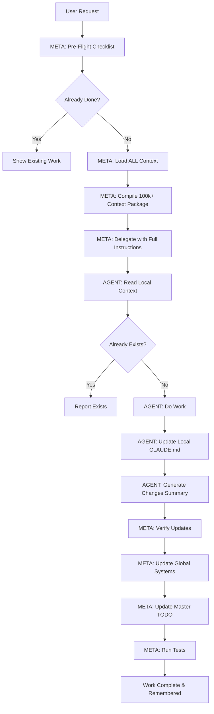

# 🧠 META ORCHESTRATOR COMPLETE WORKFLOW V3.0
*MAXIMUM CONTEXT. MAXIMUM RETENTION. ZERO REPETITION.*

## THE PROBLEM WE'RE SOLVING
- Agents rebuild features that already exist
- Context gets lost between sessions
- Work gets repeated because agents don't know what's done
- Features marked complete get rebuilt

## THE SOLUTION: 10-STEP VERIFICATION WORKFLOW

### 📋 STEP 1: META PRE-FLIGHT CHECKLIST (BEFORE ANY TASK)
```python
def meta_preflight_checklist():
    # LOAD EVERYTHING FIRST
    global_context = Read("/home/devuser/.claude/CLAUDE.md")  # 237 lines
    master_todo = Read("/public/MasterV2/income-clarity/MASTER_TODO_FINAL.md")
    blueprint = Read("/public/MasterV2/income-clarity/SUPER_CARDS_BLUEPRINT.md")
    daily_memory = Read(f"/public/MasterV2/AGENT_MEMORY/daily/{TODAY}.md")
    current_todos = TodoWrite.get_current()
    
    # DETERMINE WORK LOCATION
    work_folder = determine_folder_from_task(user_request)
    local_context = Read(f"{work_folder}/CLAUDE.md") if exists
    
    # CHECK IF WORK IS ALREADY DONE
    if "Recent Changes" in local_context:
        recent_work = parse_recent_changes(local_context)
        if task_already_completed(user_request, recent_work):
            return "TASK ALREADY COMPLETE - Show user the existing implementation"
    
    return {
        "context_loaded": true,
        "work_location": work_folder,
        "existing_work": recent_work,
        "can_proceed": true
    }
```

### 📋 STEP 2: META CONTEXT COMPILATION (MAXIMUM RELEVANT CONTEXT)
```python
def compile_agent_context(task, preflight_data):
    # BUILD COMPLETE CONTEXT PACKAGE (USE ALL TOKENS NEEDED)
    context_package = {
        # MANDATORY CONTEXT (ALWAYS INCLUDE)
        "task": task,
        "work_folder": preflight_data.work_folder,
        "local_context": preflight_data.local_context,  # What's been done here
        "master_todo": relevant_sections_only,          # Current priorities
        "blueprint": relevant_architecture,             # How things connect
        
        # TASK-SPECIFIC CONTEXT (INCLUDE EVERYTHING RELEVANT)
        "related_files": load_all_related_files(),      # 50-100k if needed
        "examples": load_all_relevant_examples(),       # Multiple examples OK
        "apis": load_all_relevant_apis(),              # All endpoints
        "services": load_all_relevant_services(),      # All business logic
        "types": load_all_types_and_interfaces(),      # Complete typing
        "tests": load_existing_tests(),                # Know what's tested
        
        # VERIFICATION CONTEXT
        "already_implemented": preflight_data.existing_work,
        "do_not_repeat": list_of_completed_features
    }
    
    return context_package  # Can be 100k+ tokens - WE DON'T CARE!
```

### 📋 STEP 3: META DELEGATION WITH COMPLETE INSTRUCTIONS
```typescript
Task({
    subagent_type: determine_best_agent(task),
    prompt: `
    ============================================
    MANDATORY WORKFLOW - FOLLOW EXACTLY
    ============================================
    
    1. FIRST ACTION - READ LOCAL CONTEXT:
       Read: ${work_folder}/CLAUDE.md
       Check "Recent Changes" section
       Check "Next Steps" section
       
    2. VERIFY WORK NOT ALREADY DONE:
       Already implemented features:
       ${list_all_completed_features}
       
       If the feature exists, STOP and report it exists.
       
    3. YOUR SPECIFIC TASK:
       ${task_description}
       
    4. COMPLETE CONTEXT PROVIDED (${total_tokens} tokens):
       ${context_package}
       
    5. MANDATORY UPDATES AFTER WORK:
       - Update ${work_folder}/CLAUDE.md "Recent Changes"
       - Update ${work_folder}/CLAUDE.md "Next Steps"
       - Create CHANGES_SUMMARY (see below)
       
    6. MANDATORY CHANGES SUMMARY FORMAT:
       === CHANGES SUMMARY ===
       • New Files: [full paths]
       • Modified Files: [full paths]
       • New APIs: [endpoints created]
       • New Services: [services added]
       • New Scripts: [scripts created]
       • Database Changes: [schema updates]
       • Dependencies Added: [npm packages]
       • Features Completed: [what's now working]
       • Features Still Pending: [what's not done]
       =======================
       
    REMEMBER: We're using MAXIMUM CONTEXT for QUALITY.
    You have everything you need. Don't search for more files.
    `
})
```

### 📋 STEP 4: AGENT EXECUTION PROTOCOL
```python
# AGENT MUST FOLLOW THIS EXACTLY
def agent_execution_protocol():
    # 1. LOAD LOCAL CONTEXT FIRST
    local_claude = Read(f"{work_folder}/CLAUDE.md")
    
    # 2. CHECK WHAT'S ALREADY DONE
    recent_changes = parse_section(local_claude, "Recent Changes")
    if feature_already_exists(recent_changes):
        return "Feature already implemented at: [location]"
    
    # 3. DO THE ACTUAL WORK
    implement_feature()
    
    # 4. UPDATE LOCAL CONTEXT
    update_claude_md(work_folder, {
        "Recent Changes": f"+ {TODAY}: Implemented {feature_name}",
        "Next Steps": update_remaining_tasks()
    })
    
    # 5. GENERATE CHANGES SUMMARY
    return generate_changes_summary()
```

### 📋 STEP 5: META POST-TASK VERIFICATION
```python
def meta_verify_completion(agent_response):
    # 1. VERIFY LOCAL CONTEXT WAS UPDATED
    local_claude = Read(f"{work_folder}/CLAUDE.md")
    if TODAY not in local_claude:
        ERROR: "Agent didn't update local CLAUDE.md!"
        RETRY: with explicit reminder
    
    # 2. PARSE CHANGES SUMMARY
    changes = parse_changes_summary(agent_response)
    
    # 3. UPDATE GLOBAL SYSTEMS
    if changes.new_apis:
        update_global_claude("API_ENDPOINTS", changes.new_apis)
    if changes.new_services:
        update_global_claude("SERVICES", changes.new_services)
    if changes.new_scripts:
        update_global_claude("SCRIPTS", changes.new_scripts)
    
    # 4. UPDATE MASTER TODO
    update_master_todo(changes.features_completed)
    
    # 5. UPDATE DAILY MEMORY
    update_daily_memory(changes)
    
    # 6. RUN VERIFICATION TEST
    run_tests_for_changed_files(changes.modified_files)
    
    return "VERIFIED: All updates complete"
```

### 📋 STEP 6: PERSISTENCE LAYER (SURVIVES DISCONNECTS)
```yaml
Files That Get Updated:
  Local Context:
    - features/[feature]/CLAUDE.md        # Feature-specific memory
    
  Global Context:
    - /home/devuser/.claude/CLAUDE.md     # Global orchestrator knowledge
    - MASTER_TODO_FINAL.md                 # Task tracking
    - SUPER_CARDS_BLUEPRINT.md            # Architecture updates
    - /AGENT_MEMORY/daily/[DATE].md       # Daily session log
    
  Verification:
    - META_VERIFICATION_LOG.md            # What was verified when
    - COMPLETED_FEATURES.md               # List of done features
```

### 📋 STEP 7: DUPLICATION PREVENTION SYSTEM
```python
def prevent_duplicate_work():
    # BEFORE DELEGATING ANY TASK
    
    # 1. Check if feature exists in code
    feature_files = Glob(f"**/*{feature_name}*")
    if feature_files:
        analyze_existing_implementation()
    
    # 2. Check completed features list
    completed = Read("COMPLETED_FEATURES.md")
    if feature_name in completed:
        return "Already implemented on {date} by {agent}"
    
    # 3. Check recent changes in all CLAUDE.md files
    all_claude_files = Glob("**/CLAUDE.md")
    for file in all_claude_files:
        if feature_mentioned_as_complete(file):
            return "Already implemented in {folder}"
    
    # 4. Check MASTER_TODO for completion
    if todo_marked_complete(feature_name):
        return "Already marked complete in MASTER_TODO"
    
    return "Safe to proceed - not duplicate"
```

### 📋 STEP 8: MEMORY RETENTION PROTOCOLS
```markdown
## Every Session MUST:

### START OF SESSION
1. Load ALL memory files
2. Build complete context map
3. Know what's been done

### DURING WORK
1. Update local CLAUDE.md after EVERY change
2. Update MASTER_TODO after EVERY task
3. Create verification records

### END OF SESSION
1. Update all CLAUDE.md files
2. Update MASTER_TODO_FINAL.md
3. Update daily memory
4. Create session summary
5. Update COMPLETED_FEATURES.md
```

### 📋 STEP 9: AGENT INSTRUCTIONS TEMPLATE
```markdown
# MANDATORY AGENT INSTRUCTIONS (INCLUDE IN EVERY DELEGATION)

## YOU MUST FOLLOW THIS WORKFLOW:

1. **READ FIRST** (MANDATORY)
   - Read local CLAUDE.md in your work folder
   - Check what's already been done
   - Check what's planned next

2. **VERIFY FIRST** (MANDATORY)  
   - Check if this feature already exists
   - Look for existing implementations
   - Don't rebuild what's already there

3. **WORK SMART** (USE ALL CONTEXT)
   - You have ${X} tokens of context
   - Everything you need is provided
   - Don't search for additional files
   - Follow the patterns shown

4. **UPDATE ALWAYS** (MANDATORY)
   - Update local CLAUDE.md "Recent Changes"
   - Mark completed items in "Next Steps"
   - Note any new discoveries

5. **REPORT COMPLETELY** (MANDATORY)
   - List all new files created
   - List all files modified
   - List all features completed
   - List what's still pending

FAILURE TO UPDATE = TASK INCOMPLETE
```

### 📋 STEP 10: COMPLETE WORKFLOW SUMMARY



## 🚨 CRITICAL SUCCESS FACTORS

### 1. USE MAXIMUM CONTEXT
- Don't limit to 20-50k tokens
- Load 100k+ if needed for completeness
- Include ALL relevant examples
- Include ALL relevant patterns
- Quality > Token Savings

### 2. VERIFY EVERYTHING
- Check before starting work
- Check after completing work
- Update multiple places
- Create audit trails

### 3. UPDATE EVERYTHING
- Local CLAUDE.md (feature memory)
- Global CLAUDE.md (system knowledge)
- MASTER_TODO_FINAL.md (task tracking)
- Daily memory (session log)
- COMPLETED_FEATURES.md (done list)

### 4. NEVER TRUST SINGLE MEMORY
- Multiple files tracking same info
- Cross-reference between sources
- Verify from multiple angles
- Test to confirm

## 🎯 THE RESULT

With this workflow:
- **No feature gets built twice**
- **No context gets lost**
- **Every change is tracked**
- **Every session builds on previous**
- **Agents KNOW what's done**
- **Quality is maximized**

## 📝 IMPLEMENTATION CHECKLIST

### To Start Using This Workflow:

- [ ] Update global CLAUDE.md with this workflow
- [ ] Create COMPLETED_FEATURES.md file
- [ ] Create META_VERIFICATION_LOG.md file
- [ ] Update all folder CLAUDE.md files with standard format
- [ ] Train META to use pre-flight checklist
- [ ] Train agents to read local context first
- [ ] Set up verification tests
- [ ] Document first successful run

## 🚀 EXAMPLE EXECUTION

### User Says: "Add income projections to the dashboard"

1. **META Pre-Flight**:
   - Loads all context files
   - Checks features/income/CLAUDE.md
   - Sees "Income projections" in Recent Changes
   - **STOPS** - "This feature already exists at features/income/components/ProjectionCalculator.tsx"

### User Says: "Add expense tracking"

1. **META Pre-Flight**:
   - Loads all context files
   - Checks features/expenses/CLAUDE.md
   - No "expense tracking" in Recent Changes
   - Proceeds with full context load

2. **META Compiles Context**:
   - Loads 100k tokens of context
   - Includes all expense-related files
   - Includes portfolio examples for patterns
   - Includes complete database schema

3. **META Delegates**:
   - Sends to ux-performance-specialist
   - Includes all context + verification instructions

4. **Agent Works**:
   - Reads local context first
   - Implements expense tracking
   - Updates features/expenses/CLAUDE.md
   - Reports changes

5. **META Verifies**:
   - Confirms CLAUDE.md updated
   - Updates MASTER_TODO_FINAL.md
   - Updates global CLAUDE.md with new APIs
   - Runs tests
   - Marks complete

**RESULT**: Feature implemented once, remembered forever

---

# THIS IS THE WAY
Maximum context. Maximum retention. Zero repetition.