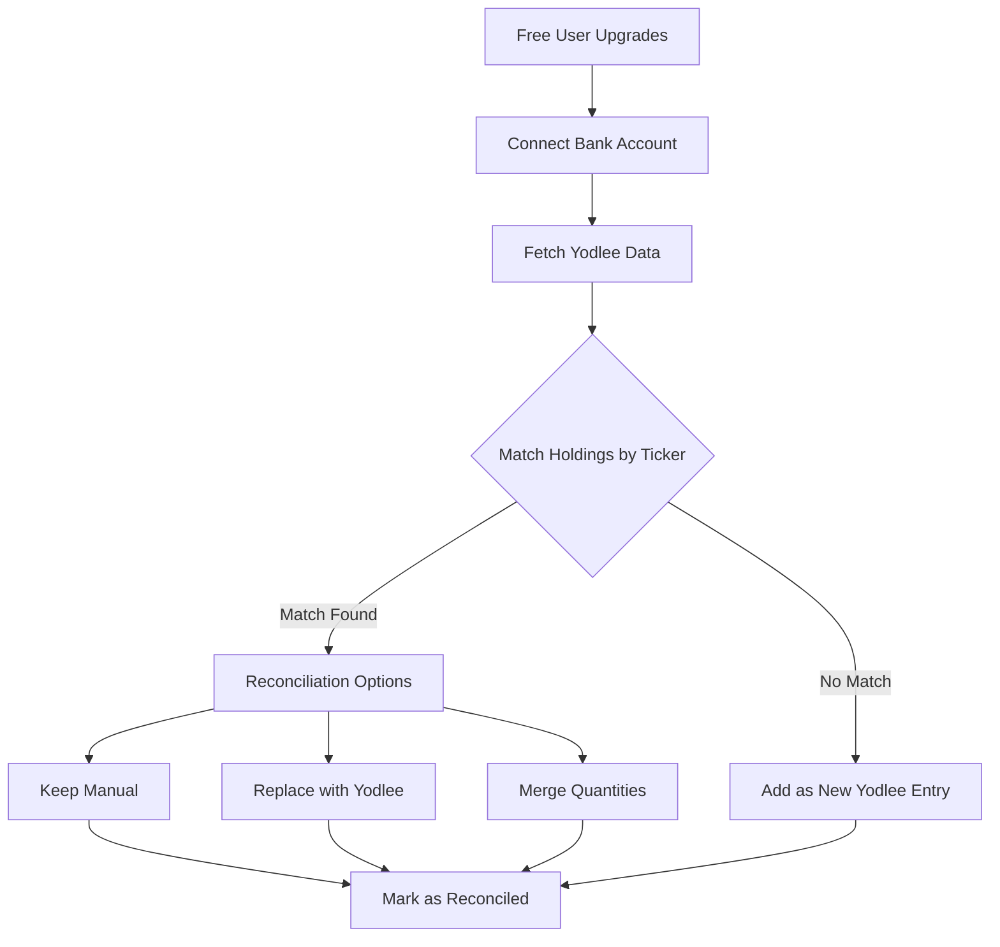

# 🏦 Yodlee Full Integration Plan for Income Clarity
*Comprehensive Strategy for Dual-Source Financial Data Management*

## 📊 Executive Summary

Transform Income Clarity into a freemium SaaS platform with:
- **FREE Tier**: Manual stock/ETF entry only
- **PREMIUM Tier**: Automatic bank sync via Yodlee + manual entry
- **Hybrid Data**: Seamless integration of manual and automated data

## 🎯 Integration Architecture

### User Segmentation
```
┌─────────────────────────────────────────────────┐
│                  Income Clarity                  │
├─────────────────────────────────────────────────┤
│         FREE USERS              PREMIUM USERS    │
│    ┌──────────────┐         ┌──────────────┐    │
│    │ Manual Entry │         │ Manual Entry │    │
│    │   (Stocks,   │         │      +       │    │
│    │    ETFs)     │         │ Yodlee Sync  │    │
│    └──────────────┘         └──────────────┘    │
│           │                        │             │
│           └────────┬───────────────┘             │
│                    ▼                             │
│         ┌──────────────────┐                    │
│         │  Unified Data    │                    │
│         │     Layer        │                    │
│         └──────────────────┘                    │
│                    │                             │
│                    ▼                             │
│         ┌──────────────────┐                    │
│         │   Super Cards    │                    │
│         │   Dashboard      │                    │
│         └──────────────────┘                    │
└─────────────────────────────────────────────────┘
```

## 🗄️ Database Schema Updates

### 1. User Model Enhancement
```prisma
model User {
  // Existing fields...
  
  // Premium features
  isPremium         Boolean   @default(false)
  premiumStartDate  DateTime?
  premiumEndDate    DateTime?
  trialEndDate      DateTime?
  
  // Subscription
  subscription      UserSubscription?
}

model UserSubscription {
  id                String   @id @default(uuid())
  userId            String   @unique
  plan              String   // FREE, PREMIUM, ENTERPRISE
  status            String   // ACTIVE, CANCELLED, EXPIRED
  stripeCustomerId  String?
  stripeSubId       String?
  createdAt         DateTime @default(now())
  updatedAt         DateTime @updatedAt
  
  user              User     @relation(fields: [userId], references: [id])
}
```

### 2. Holdings with Data Source
```prisma
model Holding {
  // Existing fields...
  
  // Data source tracking
  dataSource        DataSource @default(MANUAL) // MANUAL, YODLEE, MERGED
  yodleeAccountId   String?    // Links to specific bank account
  lastSyncedAt      DateTime?  // When Yodlee last updated
  isReconciled      Boolean    @default(false)
  reconciledAt      DateTime?
  
  // Relationships
  yodleeAccount     SyncedAccount? @relation(fields: [yodleeAccountId], references: [id])
}

enum DataSource {
  MANUAL
  YODLEE
  MERGED
}
```

### 3. Sync Tracking
```prisma
model SyncLog {
  id            String   @id @default(uuid())
  userId        String
  syncType      String   // LOGIN, SCHEDULED, MANUAL
  status        String   // PENDING, SUCCESS, FAILED
  itemsSynced   Int      @default(0)
  errorMessage  String?
  startedAt     DateTime
  completedAt   DateTime?
  
  user          User     @relation(fields: [userId], references: [id])
  
  @@index([userId, startedAt])
}
```

## 🔄 Refresh Strategy

### 1. Automatic Refresh Triggers
| Trigger | Condition | Rate Limit | Priority |
|---------|-----------|------------|----------|
| **Login Refresh** | Last sync > 4 hours | 1 per session | HIGH |
| **Nightly Batch** | 2 AM local time | Daily | MEDIUM |
| **Manual Refresh** | User initiated | 1 per hour | HIGH |
| **Webhook** | Yodlee push | Real-time | HIGHEST |
| **Error Retry** | Failed sync | 3 attempts | LOW |

### 2. Sync Implementation
```typescript
// /lib/services/sync/sync-orchestrator.service.ts
export class SyncOrchestrator {
  async performSync(userId: string, syncType: SyncType) {
    // 1. Check rate limits
    if (!this.canSync(userId)) return;
    
    // 2. Create sync log
    const syncLog = await this.startSyncLog(userId, syncType);
    
    // 3. Fetch from Yodlee
    const yodleeData = await this.fetchYodleeData(userId);
    
    // 4. Reconcile with existing data
    const reconciled = await this.reconcileData(userId, yodleeData);
    
    // 5. Update database
    await this.updateDatabase(reconciled);
    
    // 6. Update Super Cards cache
    await this.invalidateCache(userId);
    
    // 7. Complete sync log
    await this.completeSyncLog(syncLog);
  }
}
```

## 🔀 Data Reconciliation Strategy

### Free → Premium Upgrade Flow


### Reconciliation Rules
1. **Exact Match**: Same ticker → User chooses action
2. **Partial Match**: Similar name → Suggest matching
3. **No Match**: Keep separate with source badges
4. **Duplicate Prevention**: Check ISIN/CUSIP if available

## 🎨 UI/UX Updates

### 1. Data Source Indicators
```typescript
// Visual badges for data origin
<Badge variant={holding.dataSource}>
  {holding.dataSource === 'YODLEE' ? '🏦' : '✋'} 
  {holding.dataSource}
</Badge>

// Freshness indicator
<FreshnessIndicator 
  lastUpdated={holding.lastSyncedAt || holding.updatedAt}
  isStale={isOlderThan(holding.lastSyncedAt, '24h')}
/>
```

### 2. Premium Features Lock
```typescript
// Free user sees locked features
{!user.isPremium && (
  <LockedFeature 
    title="Bank Connections"
    description="Automatically sync your portfolio"
    upgradeLink="/pricing"
  />
)}
```

### 3. Sync Status Header
```typescript
// Premium users see sync status
{user.isPremium && (
  <SyncStatus 
    lastSync={user.lastSyncedAt}
    isSyncing={syncInProgress}
    onRefresh={handleManualRefresh}
  />
)}
```

## 🤖 Agent Assignments

### Phase 1: Database & Architecture
- **systems-architect**: Design data schema migrations
- **reliability-api-engineer**: Create sync service endpoints
- **code-quality-manager**: Refactor existing services

### Phase 2: Core Integration
- **reliability-api-engineer**: Implement sync orchestrator
- **code-quality-manager**: Build reconciliation engine
- **ux-performance-specialist**: Create UI indicators

### Phase 3: Background Jobs
- **reliability-api-engineer**: Set up job queues
- **systems-architect**: Design cron architecture
- **quality-assurance-specialist**: Test sync reliability

### Phase 4: Premium Features
- **ux-performance-specialist**: Build upgrade flows
- **saas-cx-strategist**: Design pricing tiers
- **documentation-writer**: Create user guides

## 📁 New Directory Structure

```
/lib/services/
├── sync/
│   ├── CLAUDE.md                 # Sync patterns & strategies
│   ├── sync-orchestrator.service.ts
│   ├── sync-scheduler.service.ts
│   └── sync-queue.service.ts
│
├── reconciliation/
│   ├── CLAUDE.md                 # Matching algorithms
│   ├── data-reconciler.service.ts
│   ├── conflict-resolver.service.ts
│   └── duplicate-detector.service.ts
│
└── subscription/
    ├── CLAUDE.md                 # Payment logic
    ├── subscription.service.ts
    ├── stripe.service.ts
    └── feature-gate.service.ts

/app/api/
├── sync/
│   ├── manual/route.ts          # Manual refresh endpoint
│   ├── status/route.ts          # Sync status check
│   └── webhook/route.ts         # Yodlee webhooks
│
└── subscription/
    ├── upgrade/route.ts         # Upgrade to premium
    ├── cancel/route.ts          # Cancel subscription
    └── webhook/route.ts         # Stripe webhooks

/components/
├── premium/
│   ├── CLAUDE.md                # Premium UI patterns
│   ├── UpgradePrompt.tsx
│   ├── PremiumBadge.tsx
│   └── FeatureGate.tsx
│
└── sync/
    ├── SyncStatus.tsx
    ├── DataSourceBadge.tsx
    └── ReconciliationModal.tsx

/scripts/
└── cron/
    ├── CLAUDE.md                # Job documentation
    ├── nightly-sync.js
    ├── cleanup-old-syncs.js
    └── monitor-sync-health.js
```

## 📋 Implementation Phases

### Phase 1: Foundation (Week 1)
- [ ] Update Prisma schema with data source fields
- [ ] Create UserSubscription model
- [ ] Add isPremium flag to User
- [ ] Create SyncLog table
- [ ] Run database migrations
- [ ] Update existing queries

### Phase 2: Data Layer (Week 2)
- [ ] Build sync orchestrator service
- [ ] Create reconciliation engine
- [ ] Implement duplicate detection
- [ ] Add conflict resolution UI
- [ ] Update Super Cards services
- [ ] Add data source filtering

### Phase 3: Sync Infrastructure (Week 3)
- [ ] Implement login refresh logic
- [ ] Create nightly sync cron job
- [ ] Add manual refresh with rate limiting
- [ ] Set up job queue (Bull/BullMQ)
- [ ] Implement retry logic
- [ ] Add sync monitoring

### Phase 4: Premium Features (Week 4)
- [ ] Create subscription service
- [ ] Build upgrade flow UI
- [ ] Add feature gates
- [ ] Implement payment processing
- [ ] Create premium dashboard
- [ ] Add usage analytics

### Phase 5: Testing & Optimization (Week 5)
- [ ] Load testing with multiple users
- [ ] Test data reconciliation scenarios
- [ ] Optimize sync performance
- [ ] Add error monitoring
- [ ] Create user documentation
- [ ] Deploy to production

## 🔒 Security Considerations

1. **Data Isolation**: Row-level security for all queries
2. **Token Encryption**: AES-256 for Yodlee tokens
3. **Audit Logging**: Track all data access
4. **Rate Limiting**: Prevent API abuse
5. **2FA Requirement**: For bank connection changes
6. **GDPR Compliance**: Data deletion on request

## 📊 Performance Optimizations

1. **Caching Strategy**
   - Redis for Yodlee data (5-min TTL)
   - Database query caching
   - CDN for static assets

2. **Database Optimization**
   - Indexes on dataSource, yodleeAccountId
   - Partitioning for large transaction tables
   - Read replicas for dashboard queries

3. **Background Processing**
   - Queue system for sync jobs
   - Worker processes for heavy operations
   - Progressive data loading in UI

## 🎯 Success Metrics

- **Sync Success Rate**: > 95%
- **Average Sync Time**: < 10 seconds
- **Data Freshness**: < 24 hours old
- **Free → Premium Conversion**: > 10%
- **User Satisfaction**: > 4.5/5 stars
- **System Uptime**: > 99.9%

## 🚨 Error Handling

1. **Sync Failures**: Retry with exponential backoff
2. **Rate Limits**: Queue for later processing
3. **Data Corruption**: Rollback and alert
4. **Bank Disconnection**: Email notification
5. **Payment Failure**: Grace period + retry

## 📝 Documentation Updates

### CLAUDE.md Files to Create:
1. `/lib/services/sync/CLAUDE.md` - Sync patterns
2. `/lib/services/reconciliation/CLAUDE.md` - Matching logic
3. `/components/premium/CLAUDE.md` - Premium UI
4. `/scripts/cron/CLAUDE.md` - Background jobs

### Existing Files to Update:
1. `/CLAUDE.md` - Add Yodlee integration overview
2. `/SUPER_CARDS_BLUEPRINT.md` - Dual data source
3. `/MASTER_TODO_FINAL.md` - New integration tasks

## 🎬 Next Steps

1. **Immediate**: Create database migrations
2. **This Week**: Implement sync orchestrator
3. **Next Week**: Build reconciliation UI
4. **Month 1**: Launch premium tier
5. **Month 2**: Scale to production

---

**This plan transforms Income Clarity from a demo app into a production-ready SaaS platform with sustainable revenue model.**